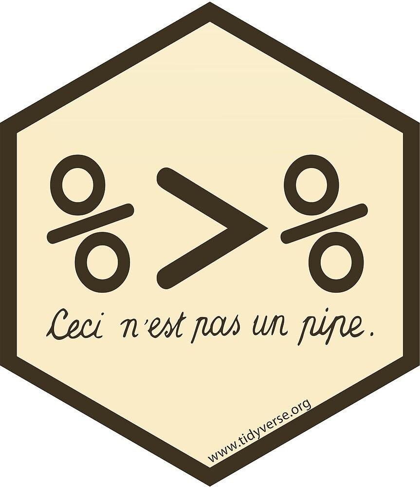

```{r xaringan-themer, include = FALSE}
#devtools::install_github("gadenbuie/xaringanthemer")
library(xaringanthemer)
library(tidyverse)
library(xaringanthemer)

mono_light(
  base_color = "#1c5253",
  header_font_google = google_font("Josefin Sans"),
  text_font_google   = google_font("Montserrat", "300", "300i"),
  code_font_google   = google_font("Droid Mono")
  )
```

```{r setup, include=FALSE}
knitr::opts_chunk$set(echo = TRUE, warning = F, message = F)
knitr::opts_chunk$set(fig.height = 6, out.width = "100%", comment = " ", cache = T, dpi = 300)
options(scipen = 9999)
options(max.print = 100)


source("https://raw.githubusercontent.com/EvaMaeRey/little_flipbooks_library/master/xaringan_reveal_parentheses_balanced.R")

base <- read.table(file = "../data/base_juguete_t3_16.txt", sep = "|")
```

class: middle, center

# ¿Qué es un paquete?


---
class: middle, center, inverse

background-image: url(img/R1.PNG)
background-position: center
background-size: contain

---

class: middle, center, inverse

background-image: url(img/R2.PNG)
background-position: center
background-size: contain

---
class: middle, center, inverse

background-image: url(img/R3.PNG)
background-position: center
background-size: contain

---
class: middle, center, inverse

background-image: url(img/R4.PNG)
background-position: center
background-size: contain

---
class: middle, center, inverse

background-image: url(img/R5.PNG)
background-position: center
background-size: contain

---
class: middle, center

# ¿Qué es [Tidyverse](https://www.tidyverse.org/)?

---
class: middle, center

#### `Tidyverse` es una colección de paquetes de R, diseñados para la ciencia de datos. 
 
#### Todos los paquetes comparten una filosofía de diseño, gramática y estructuras de datos subyacentes.

```{r echo=FALSE, out.width = '60%', fig.align = 'center'}
knitr::include_graphics("img/tidyverse.png")
```

---
class: middle, center

## Caja de herramientas

* El objetivo principal de sus paquetes y funciones es la de proveer herramientas para facilitar las tareas típicas de la ciencia de datos:

```{r echo=FALSE, out.width = '110%', fig.align = 'center'}
knitr::include_graphics("img/circuito del dato.png")

```

  
---
class: middle, center

# ¿Por qué `tidyverse`?

---

### __¿Por qué tidyverse?__

<br><br>
<br>

- __Es más simple de leer y de escribir para seres humanos__

<br>

- __Sus paquetes y funciones tienen un esquema en común. Por ejemplo, el primer parámetro de cualquier función es siempre la base de datos -o data.frame-__

<br>

- __La comunidad, basada en los principios del codigo abierto y trabajo colaborativo__


---
### __Instalación y uso__

* Sólo una vez (por computadora):
```r
install.packages("tidyverse")
```

--

* En cada inicio de sesión de R o Rstudio:
```r
library(tidyverse)
```
 
--

_No es necesario esto:_

```r
install.packages("dplyr")
install.packages("tidyr")
install.packages("ggplot2")
```

--

_Ni esto:_
```r
library(dplyr)
library(tidyr)
library(ggplot2)
```

---
class: middle, center, inverse

```{r echo=FALSE, out.width = '50%', fig.align = 'center'}

```

---

* Para calcular el promedio del ingreso por la ocupación principal (P21), en R base se hace así:
```{r}
mean(x = base$P21)
```
<br>
--

* Si queremos redondear el resultado de la operación anterior:
```{r}
round(x = mean(x = base$P21), 
      digits = 1)
```
<br>
--

* Con `tidyverse` se hace más inteligible, transformando en secuencia _izquierda / derecha_ el conjunto de operaciones, en vez de _adentro / afuera_:
```{r}
base$P21 %>%
  mean() %>%
  round(digits = 1)
```

---
class: middle, center, inverse

```{r echo=FALSE, out.width = '50%', fig.align = 'center'}
knitr::include_graphics("img/logo dplyr.png")
```

---
## Funciones del paquete dplyr:

<br>

| __Función__   | __Acción__ |
| :---          | ---:   |
| `select()`    | *selecciona o descarta variables*|
| `filter()`    | *selecciona filas*|
| `mutate()`    | *crea nuevas variables*|
| `rename()`    | *renombra variables*|
| `group_by()`  | *segmenta en funcion de una variable*|
| `summarize()` | *genera una tabla de resúmen*|


---
class: middle, center

# __select()__
***
#### _Elije o descarta columnas de una base de datos_

---
### Función _`select()`_
<br>

- Con R base:
```r
subset(x = base_de_datos, 
       select = c(columna1, columna2, columna...x))
```
<br>

--

- Con `tidyverse`, por la positiva:
```r
base_de_datos %>% 
  select(columna1, columna2, columna...x)
```
<br>

--

- Con `tidyverse`, por la negativa:
```r
base_de_datos %>% 
  select(-columna1, -columna2, -columna...x)
```

---
#### Función _`select()`_
<br>

Importemos una base de datos (ubicada en la carpeta `data` de la clase):
```{r}
base <- read.table(file = "../data/base_juguete_t3_16.txt", sep = "|")
```

--
<br>

Usemos la función `colnames()` para ver qué variables (columnas) contiene el objeto `base`:
```{r}
colnames(base)
```

---

#### Función _`select()`_

<br><br>

Supongamos que queremos trabajar sólo con las siguientes variables, según el diseño de registro de la EPH:

- `ANO4` --> _Año en el que se hizo la encuesta_

- `TRIMESTRE` --> _Trimestre en el que hizo la encuesta_

- `ESTADO` --> _Condición de actividad de la persona entrevistada (Ocupado / Desocupado / Inactivo)_

- `CAT_OCUP` --> _Categoría ocupacional de la persona entrevistada (Asalariado / Cuentrapropista / Patrón)_

---

```{r sel, eval = F, echo = F}
base %>%
  select(ANO4, TRIMESTRE, ESTADO, CAT_OCUP)
```

`r apply_reveal("sel")`

---
class: middle, center

### Otra forma de selecionar

---

```{r sel2, eval = F, echo = F}
base %>%
  select(2:6)
```

`r apply_reveal("sel2")`

---
class: middle, center

### En la selección, también damos el orden de las columnas

---

```{r sel3, rows.print=5, eval = F, echo = F}
base %>%
  select(CAT_OCUP, ESTADO, TRIMESTRE, ANO4)
```

`r apply_reveal("sel3")`

---
#### Función _`select()`_

<br>

- Imprime pero no graba: 
```{r rows.print=10}
select(base, 
       ANO4, TRIMESTRE, AGLOMERADO, ESTADO, CAT_OCUP)
```

---
#### Función _`select()`_

<br>

- Graba pero no imprime:
```{r}
base_select <- select(base, 
                      ANO4, TRIMESTRE, AGLOMERADO, ESTADO, CAT_OCUP)
```

---
#### Función _`select()`_

<br>

- Graba e imprime: 

```{r rows.print=10}
(base_select <- select(base, 
                ANO4, TRIMESTRE, AGLOMERADO, ESTADO, CAT_OCUP))
```

---
class: middle, center

# __filter()__

***

#### _Filtra casos (filas) de una base de datos en función de una o más variables_

---
### Función `filter()`
<br>

- En R base: 
```r
base_de_dato$variable[base_de_datos$variable == categoria]
```

--
<br>

- En `tidyverse`:
```r
base_de_datos %>% 
  filter(variable == categoria)
```

---
### Función `filter()`
<br>

Supongamos que queremos quedarnos con la __población ocupada__ de la base de datos. 
 
Según el diseño de registro de la EPH, la variable se llama `ESTADO` y el valor que corresponde a las y los ocupados es el `1`. 

La sentencia quedaría de la siguiente manera:

---
```{r fil1, rows.print=10, col.print=10, eval = F, echo = F}
base_select %>%
  filter(ESTADO == 1)
```

`r apply_reveal("fil1")`

---
### Función _`filter()`_

#### Condiciones por las cuales filtrar:

.pull-left[

|Condición |Acción              |
| :---     | ---:               |
|          |                    |
| `==`     | *igual*            |
| `!=`     | *distinto*         |
| `>`      | *mayor que*        |
| `<`      | *menor que*        |
| `>=`     | *mayor o igual que*|
| `<=`     | *menor o igual que*|

]

.pull-right[

| Combinador |Acción |
| :---       | ---:  |
|            |       |
| ` & `      | *y*   |
| ` , `      | *y*   |
| ` | `      | *o*   |

]

---
class: middle, center

Supongamos que queremos quedarons sólo con aquella población que cumpla las siguientes condiciones:

- Se encuentre ocupada (`ESTADO == 1`);

- Viva en _La Plata_ (`AGLOMERADO == 2`) o en el Santa Fé (`AGLOMERADO == 5`);

- Sea asalariada (`CAT_OCUP == 3`):

---
```{r fil2, rows.print=10, col.print=10, eval = F, echo = F}
base_select %>%
  filter(ESTADO == 1 & (AGLOMERADO == 2 | AGLOMERADO == 5) & CAT_OCUP != 3)
```

`r apply_reveal("fil2")`

---
class: middle, center

# __mutate()__

***

#### _Crea variables nuevas o reemplaza existentes_

---
### Función `mutate()`

<br>

- En R base: 
```r
base_de_dato$var_nueva <- base_de_datos$var_1 + base_de_datos$var_2
```
--
<br>

- En `tidyverse`:
```r
base_de_datos %>% 
   mutate(var_nueva = var_1 + var_2)
```

---
class: center, middle

Supongamos que queremos observar cuánto ganas las personas que tienen dos o más empleos. Para ello, vamos a crear una nueva variable que sume los montos de los ingresos que perciben las personas tanto por su ocupación principal (`P21`) como por otras ocupaciones (`TOT_P12`).

---
```{r mut1, rows.print=10, col.print=10, eval = F, echo = F}
base %>%
  select(ESTADO, CAT_OCUP, P21, TOT_P12) %>% 
  filter(ESTADO == 1) %>% 
  filter(P21 > 0 & TOT_P12 > 0) %>% 
  mutate(ingreso_tot = P21 + TOT_P12)
```

`r apply_reveal("mut1")`

---
class: center, middle

Con `mutate()` también se puede editar una variable ya existente en la base de datos

---
```{r mut2, rows.print=10, col.print=10, eval = F, echo = F}
base %>%
  select(ESTADO, CAT_OCUP, P21, TOT_P12) %>% 
  filter(ESTADO == 1) %>% 
  mutate(ESTADO = case_when(ESTADO == 1 ~ "Ocupado/a",
                            ESTADO == 2 ~ "Desocupado/a",
                            ESTADO == 3 ~ "Inactivo/a",
                            ESTADO == 4 ~ "Menor de 10 años"))
```

`r apply_reveal("mut2")`

---
class: middle, center

# __rename__

***

#### _Crea variables nuevas o reemplaza existentes_

---
### Función `mutate()`

<br>

- En R base: 
```r
colnames(base_de_datos)[1] <- "nombre_nuevo"
```

o

```r
colnames(base_de_datos)[colnames(base_de_datos) == 'nombre_viejo'] <- 'nombre_nuevo'
```

--
<br> 

- En `tidyverse`:
```r
base_de_datos %>% 
   rename(var_nueva = var_vieja)
```
